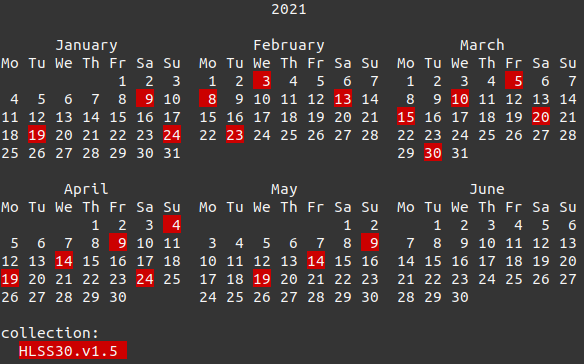
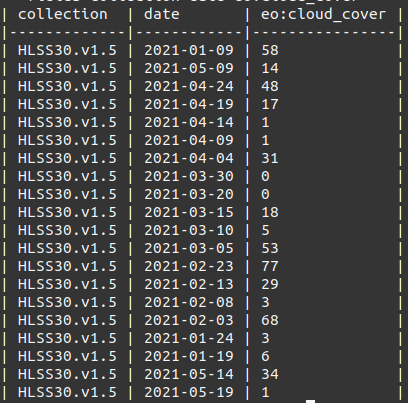

# NASA CMR-STAC Usage

This file documents how to use the CMR-STAC endpoints:

- [CMR-STAC](https://cmr.earthdata.nasa.gov/stac): The entire catalog of NASA CMR data, organized by provider.
- [CMR-CLOUDSTAC](https://cmr.earthdata.nasa.gov/cloudstac): Also organized by provider, this API only contains STAC Collections where the Item Assets are available "in the cloud" (i.e., on s3).

**Table of Contents**
1. [CMR Providers](#cmrproviders)
2. [Browsing](#browsing)
3. [Searching via CLI](#searching)

## CMR Providers

CMR-STAC is not a single STAC API, because CMR does not allow querying across all granules (the CMR equivalent of a STAC Item) in all collections. Instead, CMR-STAC includes a static root catalog that links to CMR Providers. Each CMR Provider is it's own STAC API.

For example, https://cmr.earthdata.nasa.gov/stac contains a links object with 'child' links. One of the child links, e.g., https://cmr.earthdata.nasa.gov/stac/LPCLOUD, is a STAC API that can be used in API Clients.

## Browsing

The first thing to do when getting familiar with CMR-STAC is to browse through the catalog and get a sense for what Collections and Items are. The easiest way to browse is to install a JSON extension for your browser of choice (e.g., [JSON Formatter](https://chrome.google.com/webstore/detail/json-formatter/bcjindcccaagfpapjjmafapmmgkkhgoa/related) for Chrome).


[STAC Browser](https://github.com/radiantearth/stac-browser) is a web interface to browse through
a STAC Catalog. STAC Browser is what is used in [STAC Index](https://stacindex.org/catalogs/cmr-stac#/) to be able to browse through any STAC API that has been added to the index.

Another way to browse the API is with [SnapPlanet](https://rocket.snapplanet.io/) - a more graphical interface that allows users with some basic search options. Specify the CMR-STAC Provider catalog
to SnapPlanet by specifying the `u` parameter to https://rocket.snapplanet.io/, e.g.,

https://rocket.snapplanet.io/map?u=https://cmr.earthdata.nasa.gov/stac/LPCLOUD

This displays a map interface and some filtering options including geographic and temporal.


## Searching via CLI

The Python library [pystac-client] provides a Command Line Interface (CLI) to search any STAC API.

Install pystac-client, and stacterm which will be used to summarize the results in the terminal.

```bash
pip install pystac-client stacterm
```

pystac-client requires a URL to a STAC API, and since CMR-STAC implements a STAC API for each provider, the provider STAC URL will need to be provided. Set the environment variable STAC_URL to the desired provider URL.

```bash
export STAC_URL=https://cmr.earthdata.nasa.gov/stac/LPCLOUD
```

An AOI containing a GeoJSON Feature of interest is created, using GIS Software or 
[geojson.io](http://geojson.io/)

```
$ stac-client search --intersects aoi.json --datetime 2021-01/2021-05 --matched
36 items matched
```

The `--matched` switch performs a search with limit=0 so does not get any Items, but gets the total number of 
matches which will be output to the screen.


Without the `--matched` switch, all items will be fetched, paginating if necessary. If `max_items` is provided 
it will stop paging once that many items has been retrieved. It then prints all items to stdout as an ItemCollection.
This can be useful to pipe output to another process such as [stac-terminal](https://github.com/stac-utils/stac-terminal),
[geojsonio-cli](https://github.com/mapbox/geojsonio-cli), or [jq](https://stedolan.github.io/jq/).

Here, the output is piped to `stacterm` to print a calendar of Items based on the Collection.

```
$ stac-client search --intersects aoi.json --datetime 2021-01/2021-05 | stacterm cal
```


Search by a specific collection with the `-c` switch, or make queries against Item properties such as `eo:cloud_cover`

```
$ stac-client search -c HLSS30.v1.5 --intersects aoi.json --datetime 2021-01/2021-05 | stacterm cal
```



The `table` command of `stacterm` can be used to generate Markdown tables of specified fields:

```
$ stac-client search -c HLSS30.v1.5 --intersects aoi.json --datetime 2021-01/2021-05 | stacterm table --fields collection date eo:cloud_cover
```



The results of a search can also be saved as a GeoJSON FeatureCollection file, allowing it to be used in other GIS software
to visualize where the found Items are located.

```
$ stac-client search -c HLSS30.v1.5 --intersects aoi.json --datetime 2021-01/2021-05 --save myresults.json
```
